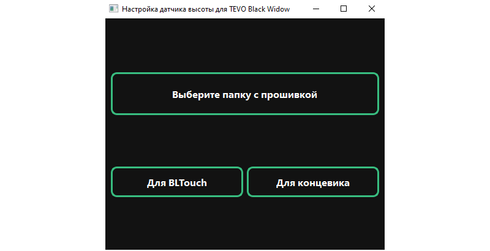

# Marlin Firmware Converter for using BLTouch

> **Marlin - open source firmware for 3D-printers based on the Arduino platform.**

> **BLTouch - automatic table alignment sensor for 3D printers, which can
accurately measure the tilt of the table surface.**
>
> 

> **Converter configures the Marlin firmware `Configuration.h` file to add
> BLTouch support. You can also apply the settings for the limit switch. The
> converter works on the principle of commenting, uncommenting and editing lines
> in `Configuration.h`. Default values of converter for TEVO Black Widow
> 3D-printer.**

## Screenshots

> ### Main Window: Firmware Not Selected
> 

> ### Main Window: Firmware Selected
> 

> ### Settings Window: BLTouch
> 

> ### Settings Window: Limit Switch
> 

> ### Qt Designer
> All windows are designed in Qt Designer. From there, .ui files are exported
> and then translated into .py files. The logic for windows is written in
> separate
> classes.
>
> 

## Settings

1. `python>=3.7.6` (lower versions not tested)

2. To configure `.ui` files in `.py` files, you need use
   `pyuic6 -x file.ui -o file.py`.

3. To create an executable file (exe), you need to use
   `pyinstaller -F -w -i "C:\GLOBAL_PATH\BLT.ico" main.py`
